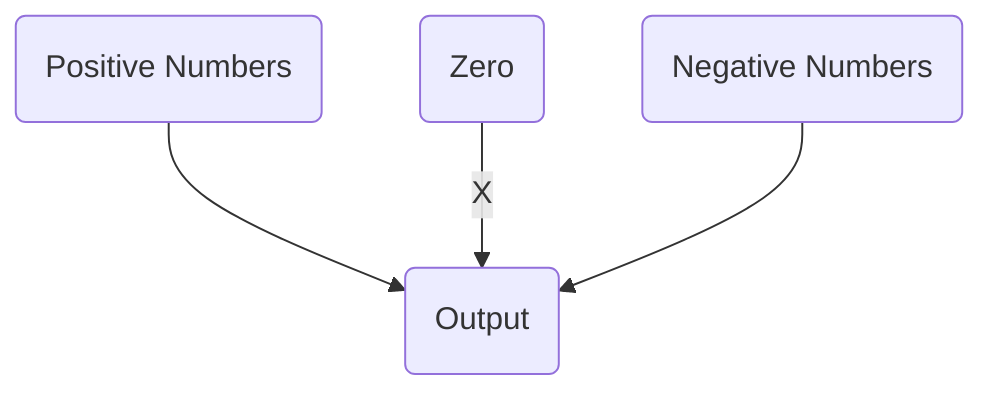

Consider the following OCaml Code:
```OCaml
let rec list_max (l:int list) : int = 
	begin match l with 
		| [] -> failwith "list_max called on []" 
		| x::[] -> x 
		| x::tl -> max x (list_max tl) 
		end
```

- Code works for everything EXCEPT "[]" case
- Empty List ([]) -> failed/aborted program

**Partial Function:** A function that isn't well-defined for all possible inputs
(i.e. not defined for all inputs)


For functions such as `(fun x -> 5/x)`, the number 0 (zero)
 is not well defined (bc 5/0 will error)
**Workaround: Use [[Option]] Types**