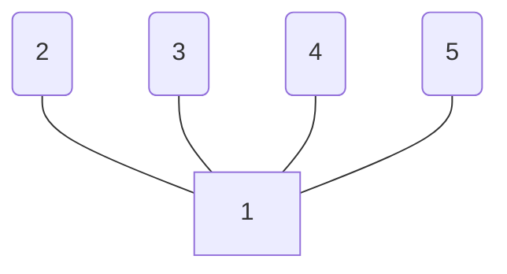

A graph is ***k-colorable*** (e.g. 3-colorable) if you can use k colors to fill in vertices so no connected vertices are the same color.

**Chromatic Number**, $\chi(G)$ is the smallest value of k that satisfies a k-colorable graph, so the smallest possible number of colors is k.

The graph can be colored in a maximum of 2 colors, since $1$ can be any color, and the rest of $2-5$ can be any of the rest of the colors.

A graph is a **bipartite graph** if it is 2-colorable

See [[Graph Coloring Proofs]]
