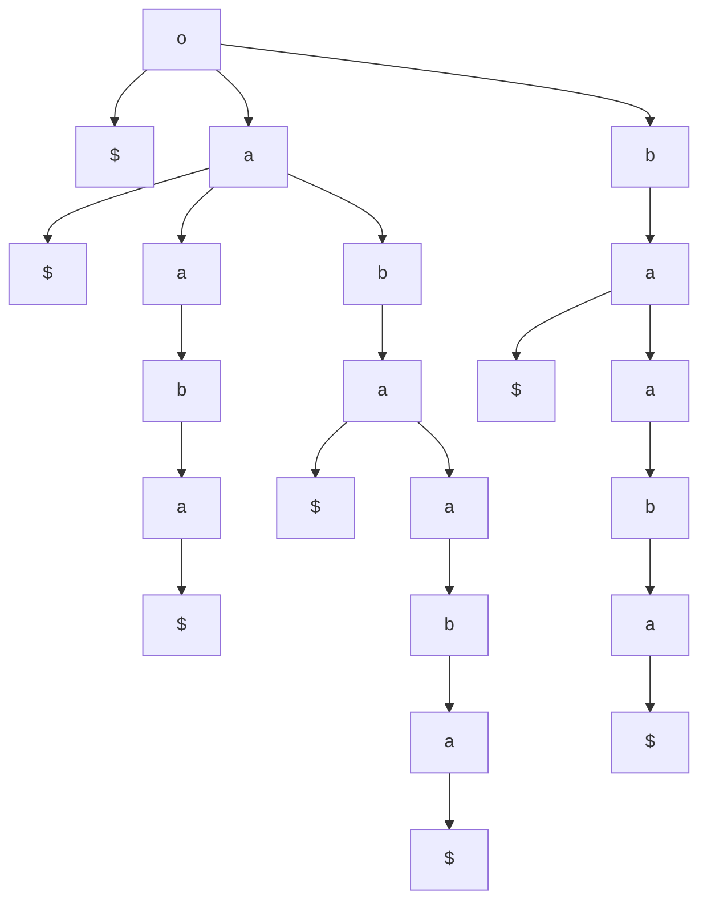
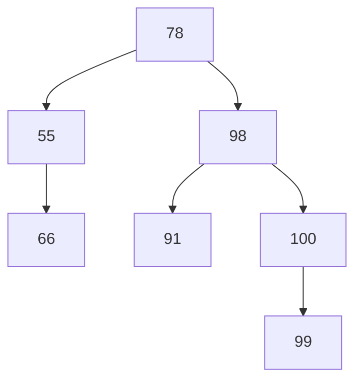

**Tries:**
- tree-based data structure that stores strings to help with efficient pattern matching
- Ordered tree
- Label $\in \Sigma$ for each node
- $\#$ strings $= \#$ leaves in the tree
- path from root to the leaf gives us the string
- $\#$ nodes $= O(n)$

**Compressed Trie:**
- all internal nodes have at least 2 children
- Total $\#$ nodes $= O(s)$
	- Total $\#$ strings
- Indexing to save space on labels

**Suffix Tries:**
- Tries in which each string is a suffix of a text
Ex. $T\$:abaaba\$$
*Note: \$ ensures that no suffix is a prefix of another suffix*
$S=\{\$,a\$.ba\$,aba\$,aaba\$,baaba\$,abaaba\$\}$


1) Is a string $s$ a substring of $T$?
	- Start at the root
	- Scan $s$ character by character
	- If we fall off the trie, output "NO"$
	- else output "YES"
- Every substring is a prefix of **some** suffix
2) Is $s$ a suffix of $T$?
	- Same as before
	- if we end at a node that has a \$ child then output "YES"
	- else output "NO"
3) How many times does $s$ appear as a substring of $T$?
	- Starting from the root, scan $s$
	- If you fall off the trie, output 0
	- else # Leaves in the subtree rooted at the last node present
4) Give us the longest repeated substring of T? (i.e. substring that is the longest that has at least two instances in the trie)
	- Deepest node with $\geq 2$ children
$|T|=m$
$\#$ Nodes in the suffix trie?
$O(m^{2})$
Ex.
```mermaid
graph TD
o --> 
```

**Suffix Tree:**
**Building a Suffix Tree:**
Given: Space = $\Theta(m^{2})$, can you automatically determine time of: Time = $\Omega(m^{2})$?
(This is guaranteed, since max  $m^2$ calls)

Time = $O(m^2)$
Space = $O(m)$

Ukonen
Time = $O(m)$
Space = $O(m))$

Question: Is $s$ a substring of $T$?

Question: Is $s$ a suffix of $T$?

Question: $\#$ times $S$ appears as a substring of $T()$

Question: Given a pattern $P$ & text $T$, find all $k$ occurrences of $P$ in $T$
Because is a suffix tree, go through the entire suffix, for each leaf, count where the suffix begins. Highest location is the answer since this means the lowest pattern for suffix
$O(n+k)$

Question: Input two strings $x \;\&\; y$.
Output the longest common substring of $x \;\&\; y$
Build trie by concatenating $x$ and $y$ as follows:
$T: x \# y \$$
Find the deepest node whose leaves have a pound and a dollar

**Binary Search Trees**
- Binary tree
- BST property
	- For any subtree rooted at $x$, $y$ is in $x$'s left subtree iff $y.key < x.key$

Inorder(x)
	if $x \neq NIL$ then
		Inorder($x.left$)
		Print x
		Inorder($x.right$)
	Preorder
	Postorder

*Recursive Search:*
Search(x,k):
	if $x = NIL$ or $x.key=k$ then
		return $x$
	else if $k < x.key$ then
		return $Search(x.left,k)$
	else
		return $Search(x.right,k)$

*Non-recursive Search*
Search(x,k):
	while $x \neq NIL$ and $x.key \neq k$
		if $k < x.key$
			$x \leftarrow x.left$
		else
			$x \leftarrow x.right$
	return x

Min(x):
	while $x.left \neq NIL$
		$x \leftarrow x.left$
	return $x$

Max(x):
	while $x.right \neq NIL$
		$x \leftarrow x.right$
	return $x$

Successor(x):
	if $x.right \neq NIL$
		return $Min(x.right)$
	else
		$y \leftarrow x.parent$
		while $y \neq NIL$ and $x=y.right$
			$x \leftarrow y$
			$y \leftarrow y.parent$
		return $y$

