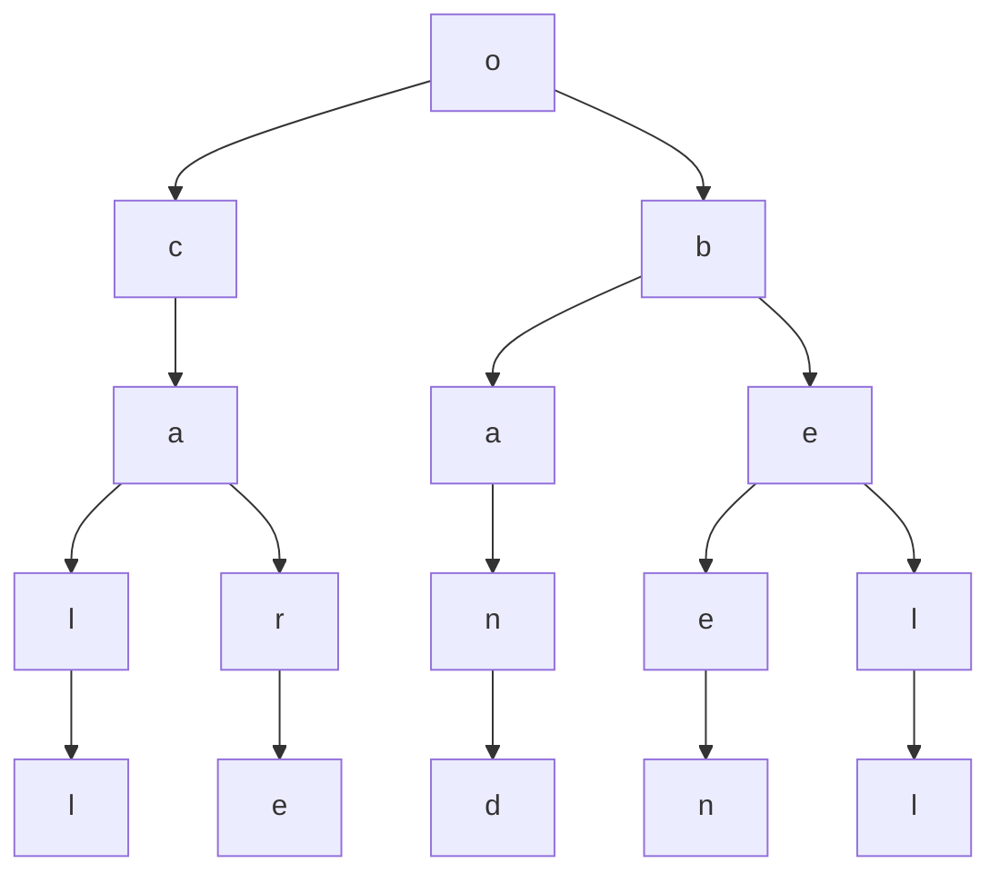
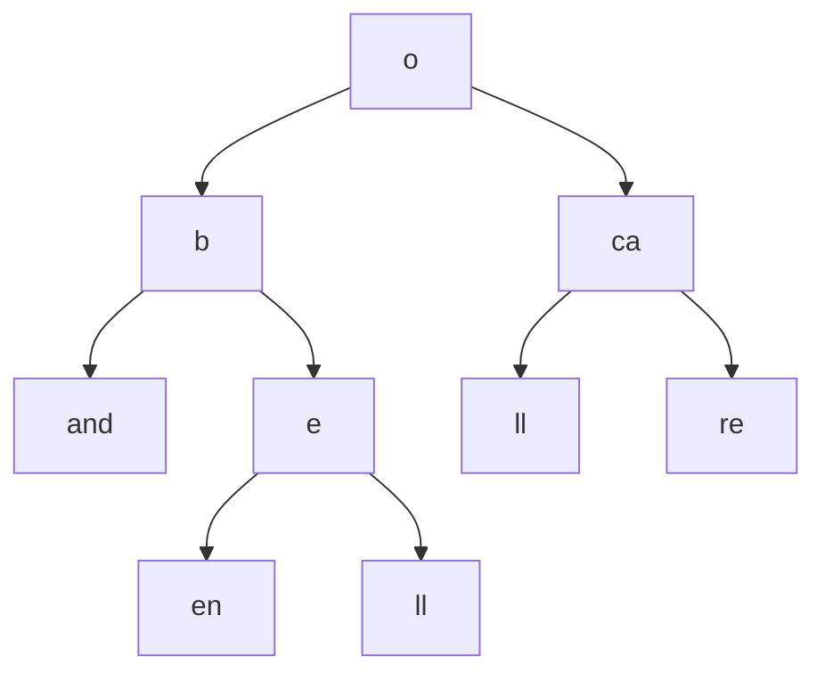

Collision resolution (LOOK INTO)
**Hashing:**
**Open Addressing**
- All elements are in the table
- $\alpha \leq 1$ ($\alpha=\frac{n}{m}$, load factor)
$h:U\times\{0,1,...,m-1\}\rightarrow\{0,1,...,m-1\}$
$U$ - key
$\{\}$ - probe #
$\{\}$ - second set is slot in the hash table
$<h(k,0),h(k,1),...,h(k,m-1)>$
is a permutation of $\{0,1,...,m-1\}$

**Uniform hashing assumption:**
All permutations are equally likely
- Linear Probability
- Quadratic Probability ($c_{1}i+c_{2}i^{2}$)
- Double Hashing

LP Hash Algorithm:
```pseudocode
h(k)=(h_{1}(k)+i)mod m
If T is full
	Output error
Else
	probe <- h_1(k), off <- + (h_3(k))
	while T[probe] != NIL do
		probe <- (probe + off) mod m
	T[probe] <- k
```

**Double Hashing:**
$h(k,i)=(h_{1}(k)+ih_{2}(k))mod\;m$
$h_{1}(k)=k mod\;13$
$h_{2}(k)=2+(kmod\;7)$

**Analysis:**
- n: $\#$ elements in the table
- m: site of the table
- $\alpha=\frac{n}{m}\rightarrow$ load factor

**Thus:** In an unsuccessful search, in hashing with open addressing, under the uniform hashing assumption, total $\#$ probes $\leq n+1$ in expectation
**Proof:** Let $X$ be the random variable denoting the number of probes needed in an unsuccessful search
$E[x]=\sum\limits_{i=1}^{\infty}Pr[x \geq i]$
(x: nm negative integer)
$A_{j}$ is the event that $j$ happened when the $k$ slot was full
$Pr[x \geq i]=Pr[A_{1}\cap A_{2}\cap ... \cap A_{i-1}]$
$=Pr[A_{1}]*Pr[A_{2}|A_{1}]*Pr[A_{3}|A_{1}\cap A_{2}]...$
$=\frac{n}{m}*\frac{n-1}{m-1}*\frac{n-2}{m-2}...\frac{n-(i-2)}{m-(i-2)}$
$\leq \frac{n}{m}*\frac{n}{m}...\frac{n}{m}$
$=(\alpha)^{i-1}$

$E[x]=\sum\limits_{i=1}^{\infty}\alpha^{i-1}$
=$\sum\limits_{i=0}^{\infty}\alpha^{i}$
$=\frac{1}{1-a}$
**AH analysis:**
Let X be the geometric r.v. with successful prob $1-\alpha$
$E[x]=\frac{1}{1-\alpha}$

**Successful search**
**Thm:** In a hashing with open addressing where Simple Uniform Hashing Assumption (it is equally likely that any of the $n$ slots is chosen, can get to the same slot again) is true, in expectation the $\#$ proves for a successful search $\leq \frac{1}{\alpha}lg(\frac{1}{1-\alpha})$
Consider:
$x_{1},x_{2},...,x_{n}$ be the order in which the elements are in inserted
Insert first $\frac{m}{2}$ elems
$\#$ empty slots denoting each of the inserts $\geq \frac{m}{2}$
Expected $\#$ of probes for each insert $\leq 2$
Total $\#$ probes $\leq \frac{m}{2}*2=m$

**Next $\frac{n}{4}$ elems**
$\#$ empty slots denoting each of the $\frac{m}{4}$inserts $\geq \frac{m}{4}$
Expected $\#$ probes for each insert $\leq 4$
Total $\#$ probes $\leq \frac{m}{4}*4$
$=m$

Total $\#$ probes to insert
$\frac{m}{2}+\frac{m}{2^{2}}+\frac{m}{2^{3}}+...+\frac{m}{2^{i}} \leq mi$
Fraction of table that is empty $=\frac{1}{2^{i}}$
Fraction of table that is empty after inserting $n$ elems $=1-\alpha$
$\frac{1}{2^{i}}=1-\alpha$
$i=lg(\frac{1}{1-\alpha})$

Total $\#$ probes
$\leq m*lg(\frac{1}{1-\alpha})$
fast one probe $\leq \frac{m}{n}(lg(\frac{1}{1-\alpha}))$
$\frac{1}{\alpha}lg(\frac{1}{1-\alpha})$

**Tries:**
A *Trie* is a tree-based data structure that stores strings so as to allow fast pattern matching
*Trie* information retrieval
$S:$ set of strings
$s: |S|$
$\Sigma:$ alphabet
$n:$ the total length of a string in $S$

A **standard trie** is an ordered tree s.t.
- each non-root node has a label
- each string is associated with exactly one leaf in the tree
(e.g.)
$S[1]:$ bell
$S[2]:$ been
$S[3]:$ band
$S[4]:$ call
$S[5]:$ care


call, care, band, been, bell

- total $\#$ leaves $=s$
- Total $\#$ nodes $=O(n)$
- height of the trie: length of the longest string (no string is a prefix of another string)

Time to search for a string of length $m=O(m)$
$O(md)$, where $d=|\Sigma|$

**Compressed Trie:**
- make sure that each internal node has $\geq 2$ children


$O(s)$

**Suffix Tree**
$T:abaaba\$$
$S[1]:\$$
$S[2]:a\$$
$S[3]:ba\$$
$S[4]=aba\$$
