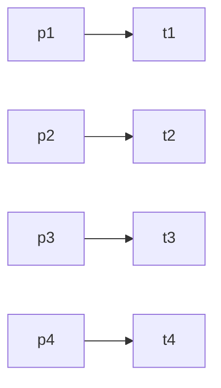
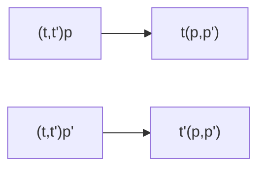
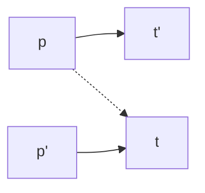
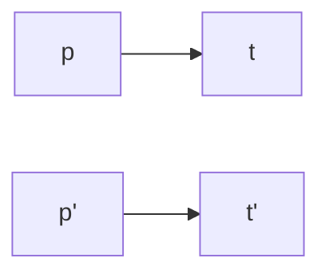

   **Stable Matching:**
	*Input:* n people, denoted $p_1,p_2,p_3...p_n$
		n pets, denoted $t_{1},t_{2},t_{3}... t_n$

each person ranks pets in order of preference
each pet ranks person in order of preference

**Your objective:**
To output a matching people & pets s.t.
- each person is paired with exactly one pet
- each pet is paired with exactly one person
*Note: This is a perfect matching*

Just match $p_{1}$ to $t_{1}$, $p_2$ to $t_{2}$, etc. (This satisfies the perfect matching)

**Additional condition:**
- There is no **instability**
	- There does not exist a pet and person where their respective partners are ranked lower on each one's respective list

Q1: Do all instances have a stable matching?

Q2: Can an input have $>1$ stable matching?

Only one stable matching (no other matchings are stable)

**Algorithm for Stable Matching:**
Randomly create a perfect match of all the nodes, if there is instability, try a different permutation

*Problem: Extremely inefficient*
Let's say the graph exists above:

For $p_{k+1}$, if it prefers one of the $t_{1}...t_{k}$, then it will propose to that $t_n$. If $t_n$ agrees, then they switch, and $p_n$ links with $t_{k+1}$

**This algorithm (Gale-Shapely):**
1. Initially all people & pets are free
2. **while** there is a free person *p* who has not yet proposed to all pets **do**:
	3. t <-- highest ranked pet who *p* has not yet proposed to
	4. **if** *t* is free **then**
		5. (p,t) becomes a pair
	6. **else if** (p',t) exists, **then**
		7. **if** *t* prefers *p* over *p'*, **then**
			8. (p,t) becomes a pair
			9. *p'* becomes free

Question: Does this algorithm always terminate?
$n^2$ operations
	- each person proposes $\leq$ n times
	- n people
	- $n*n=n^2$
**Yes**, bounded by $n^2$

**Observation 1 (This is entirely true):**
After a pet receives their first proposal they always remain engaged & as the algorithm progresses, their partners can only get better.

**Lemma:** Gale-Shapely Algorithm outputs a **perfect matching**
**Proof Sketch**
Case 1: At the end of the algorithm a person p is free
- Clearly, p must have proposed to all pets
- all pets are engaged
- Since there are n pets but n-1 people, by PHP, there is a person who is paired with $\geq$ 2 pets
Thus this is a **contradiction**, so there is a perfect matching
^
**Is it a contradiction because each person must only be matched with strictly one pet?**

Case 2: A pet is free, then there must be one person who has not proposed yet... **FINISH THE PROOF**
**Just use PHP**

**Why must there be one person who has not yet proposed? Because all of them need to be paired according to PHP?**
They just become a pair if both are free

**[[Theorems]]** Gale Shapely Algorithm outputs a **stable matching**
Proof: Assume for contradiction that at the end of the GS alg, there is an unstable pair $(p,t)$
$(t,...,t')$

- *p* proposes to *t* before they get to *t'*
- $t$ rejects $p$
- By observation 1, t's partners get better
- Thus, p' must rank higher than p on t's list, a contradiction

$Valid(p)=\{t|\exists \text{ stable matching that contains (p,t) as a pet}\}$ (Valid partner of p)
$Best(p)=t$ (Best partner of t)
s.t. $t \in valid(p)$
- no pet ranked higher than $t$ on $p$'s list is a valid partner of $p$
- i.e. $t$ is the highest ranked valid partner of $p$

**IMPORTANT: NEED TO CONSIDER IF IT IS A VALID PARTNER, THEN BEST**
cuz there are instances where p could pair with a t', but t is higher on the list. In this case, this means that t matches with a different partner, meaning that t was never a valid partner of p in the first place. (cuz in that case, t would have p' ranked higher than p, and vice versa, so it is not a valid partner)

Write $S*=\{(p, Best(p)|p \in \text{ People}\}$

**Thm:** GS alg always outputs S* (Since GS alg favors pets, this cannot be true, since this favors people)
**Proof:** Assume for contradiction that in some execution, say E of the GS alg, some people get rejected by their $Best(p)$ Among them, let $p$ have the honor of being the **first** one to be rejected by $Best(p)=t$
Why does t reject p?
There must be a p' that matches with t

By definition of Best(..), there must be a stable matching S containing $(p,t)$, since $Best(p) = t$

Consider the case:
S: p-->t
	p' --> t'
where 
t - (...,p',p,...)
p' - (...,t',t,...) - has to propose to t' first, then t
Timeline:
p' gets rejected by t' => p is not the 1st person to be rejected by Best(p), a contradiction

THEN

p gets rejected by t because of p'

**Question: does the algorithm favor the people or pets?**

$valid(t)=\{p|\exists \text{ a stable matching that contains (p,t) as a person}\}$ (valid partner of t)
$worst(t)=p$ (worst partner of t)
s.t. $p \in valid(t)$
- no person ranked lower than $p$ on $t$'s list is a valid partner of $t$
- i.e. $p$ is the lowest ranked valid partner of $t$

[[Theorems]] In the output of the GS alg, each pet is matched with worst()
Proof:
Assume for contradiction that some pet $t$ is **not** matched with $worst(t)=p$
Instead, $t$ is matched with $p'$. 
**so $(p,t)$ is still a matching, just that $(p',t)$ is a better matching for $t$**
$t$
$(...,p',...,p,...)$

By definition of $worst(t)$, $\exists$ a stable matching S that contains $(p,t)$, which means that $p'$ is matched with an arbitrary but particular pet $t'$:

S:

We know that the t ranking has (p' then p)
**which means by the algorithm that**  (LOOK AT AGAIN)
p' has the ranking (...,t',...,t,...)
t is not Best(p'), which is a contradiction

In output of GS alg, t is paired with p'

$t \neq Best(p')$
contradicts that $(p',t)$
exists in the output of GS alg

Thm. GS Alg always outputs S*
Proof: Assume for contradiction that in some execution of the GS algorithm, some people get rejected by their valid partners

p: first person to be rejected by $Best(p) = t$
$t$ rejects $p$ because of $p'$

There must be a stable matching S, in which p and t are paired and p' is paired with t'

For p' to even get to t, then p' must first get rejected by t'

Assume that there is a stable matching where p-t and p'-t', then because t rejected p, this means that (p'...p). However, because there is a stable matching of p' and t', then (t'...t), since otherwise they would "elope"

However, in order for p'-t, in the GS algorithm, this must mean that p' was already rejected by their valid partner t'. However, this is a contradiction since we have assumed that p gets rejected by t.

Proof: The output of GS every pet is paired with their worst
Assume that t is not paired with worst(t)=p'
Instead, t is paired with p in GS output
By definition,
p' --> t
p --> t'

For t