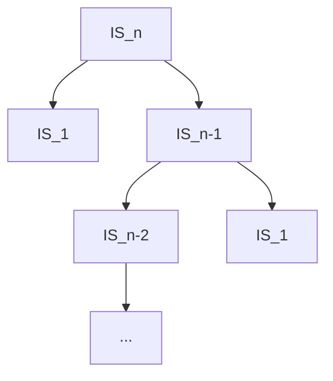
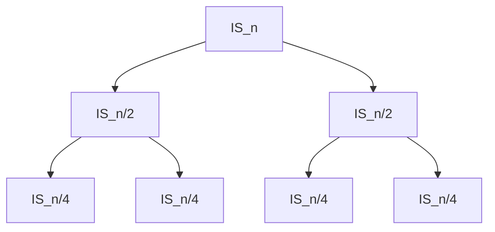

**Runtime Recurrence:**
$T(n):$ Worst case running time of po2 on an input of size $n$
$$
T(n)=\cases{O(1), n=0\\
T(n+1)+c, \text{otherwise}
}
$$
$po2(n)$
|
$po2(n-1)$
|
$po2(n-2)$
|
...
$po2(O)$

(Each has $C$, which cumulates to $C(n+1)$)

$$
\begin{align*}\\
T(n)&=T(n-1)+C\\
\end{align*}
$$

$$
\begin{align*}\\
T(n) &= 2T(n-1)+c\\
&= 2(2T(n-2)+c)+c\\
&= 2^2T(n-2)+2c+c\\
&= 2^{3}T(n-3)+2^{2}c+2c+c\\
...\\
&= 2^{k}T(n-k)
\end{align*}
$$
**Input:** A[1...n] distinct integers of integer $k$
**Output:** True, if $k \in A$
False, otherwise


```pseudocode
LS(A[1...n],k):
	if n=1 then
		return A[1] == k
	else
		return (A[n] == k) OR LS(A[1...n-1],k)
```

$$T(n)=\cases{O(1), n=1\\
T(n-1)+c, \text{otherwise}}$$
Suppose the input is sorted, then perform a binary search:
```pseudocode
BinS(A[lo...hi],k):
	if lo == hi then
		return A[lo] == k
	else
		mid <- floor(lo+hi)/2
		if A[mid] == k then
			return True
		if A[mid] < k then
			return BinS(A[mid,hi], k)
		else
			return BinS(A[lo,mid],k)
```

$$
T(n)=\cases{O(1), n=1\\
T(n/2)+c,\text{otherwise}}
$$
**Insertion Sort:**
```pseudocode
IS(A[1...n])
	if n = 1 then
		return A
	else
		A' <- IS(A[1...n-1])
		return Insert(A', A[n])
```
$$T(n)=\cases{
O(1), n=1\\
T(n-1)+cn, \text{otherwise}
}$$

$IS(n), n$
|
$IS(n-1), n-1$
|
$IS(n-2, n-2)$
|
...
$IS(1), 1$

$$\begin{align*}
T(n) &= T(n-1) + cn\\
&= T(n-2) + c(n-1) + cn\\
&= T(n-3) + c(n-2) + c(n-1) + cn\\
...\\
&= T(n-k) + c\sum\limits_{i=1}^{k-1}i
\end{align*}$$
Recursively bottoms out when $n-k=1$

$T(n)=T(1)+c\sum\limits_{i=1}^{n-1}i$
$=O(1)+c\frac{(n-1)n}{2}$
$=\theta(n^2)$

However, 
$$T(n)=\cases{
O(1), n=1\\
T(n-1)+clg(n), \text{otherwise}
}$$
works because we can halve the insertion sort algorithm (use lg(n) to find the location of the insertion, then use a linked list to add an element at that location)

**Binary search still doesn't work on a linked list**, so still need n time.

Assuming binary search does work:
$IS(n), lg(n)$
|
$IS(n-1), lg(n-1), \text{upperbound } lg(n)$
|
...
so total $=nlg(n)$

Still running time is $n^2$, let's try a different **Algorithm:**
```pseudocode
if n=1 then
	return A
else
	Merge(IS(A[1...n-1]), IS(A[n...n]))
```

$Merge(A[1...p],B[1...q])$
where $A[1...p]$ and $B[1...q]$ are both sorted
```pseudocode
if p=0 then return B
else if q=0 then return A
else if A[1] < B[1] then
	return prepend(A[1],Merge(A[2...p],B[1...q]))
else
	return prepend(B[1],Merge(A[1...p],B[2...q]))
```

$$T(n)=\cases{
O(1), n=1\\
T(n-1)+cn, \text{otherwise}
}$$

n, n-1, n-2, per layer, totals n, so $\theta(n^2)$
```pseudocode
MS(A[1...n]):
	if n=1 then
		return A
	else
		return Merge(MS(A[1...n/2],A[n/2...n])
```
$$
T(n) = \cases{O(1), n=1\\
2T\frac{n}{2}+cn
}
$$
**Practice with the above**

Every layer splits into $2$ different branches, each with max runtime of $\frac{n}{2}$. However, the overarching algorithm runs $lg(n)$ times, since it splits the algorithm into 2, so algorithm is $nlg(n)$, since each of the two algorithms run in $n$ time per layer --> This means for worst case? So what about average case, are there algorithms that are faster/slower?

$$
T(n)=2T(\frac{n}{2}+n)\\
=2[2T(\frac{n}{2^{2}}+n)]
$$