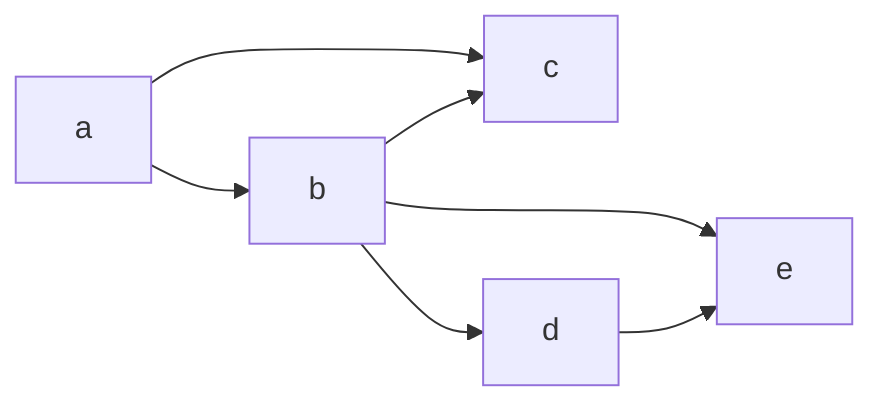
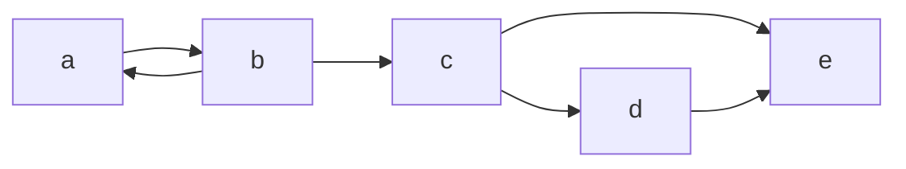
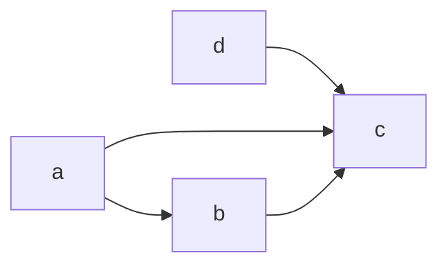

DFS
- Conditions for $v$ is a descendant of $u$?
1. $v$ is a descendant of $u$ iff $v$ is a descendant when $u$ is gray
2. Parenthesis Theorem: $v$ is a descendant of $u$ iff $du < dv < fv < fu$
3. $v$ is a descendant of $u$ in the DFS forest iff there is a White Path from $u$ to $v$ in $G$ **at time $du$** (Last section is VERY important in order to use)

Classification of edges:
- Tree edges
- Back edges
- Forward edges
- Cross edges

**Thm:** DFS on an undirected graph yields tree edges & back edges
**Proof:** Let $e=(u,v)$ be an arbitrary but particular edge in $G$. WLOG let $d[u] < d[v]$.

**Claim:** $v$ is a descendant of $u$ in the DFS forest
	By the White Path Theorem,
		Case 1: $v$ is a child of $u$ in the DFS forest. In this case, $e$ is a tree edge and we are done.
		Case 2: $v$ is a descendant of $u$ in the DFS forest, but not a child of $u$. In this case, DFS finishes at $v$ before it goes back to $u$. Edge $e$ is first explored when the search is at $v$, hence making it a back edge.

**Topological Set:**
**Input:** DAG $G=(v,e)$
**Objective:** To order vertices in $V$ in a row s.t. all edges in $E$ go from left to right.


So a --> b --> c --> d --> e

**Observation:** All DAGs have a sink, where none escape
**Proof:** Maximal path
Let there be a path $P$ with vertices $u$ and $v$, vertex $v$ is a sink iff there are no outgoing edges. Then, let path $P$ be the maximum path in the graph. Then if $v$ goes out to a different vertex, then $u,v$ is not the maximal path, and if $v$ goes back into the path, then the graph is cyclic, which cannot be possible in a DAG.

QUESTION: Are we guaranteed only one source vertex? No, because they can all converge on one point, but at that point, it doesn't matter which vertex comes first

```pseudocode
TS(G):
u <- any source in G
G' <- G - u
pi <- TS(G')
output u followed by vertices in pi
```

This runs in $O(n^{2})$ time because the problem runs to find a source in $n$ time and it iterates through all elements in $n$ time

```
TS:
L <- null set
S <- all sources in G
(loop until no more sources in S)
	u <- any source in S
	Add u to the end of L
	for each v in N(u) do:
		indegree(v)--
		if indeg(v) = 0 then
			add v to S
output L
```

Find all sources in S: $O(m+n)$ (since need to check all edges in all the vertices at least once)
For loop: $O\left(\sum\limits_{u}outdeg(u)\right)= O(m)$ time, so total, $O(n+m)$

Another algorithm for a topological set:
```pseudocode
Alg:
1. DFS(G)
2. Sort vertices in decreasing order of f(.)
```

Runtime:
$O(nlg(n)+m)$, why not just $O(n+m)$
Actually slower than the previous method this way
Instead, don't take a step to sort it, just place it in the front of the list once the DFS node finishes

Theorem:
DFS on a DAG will not yield *back edges*

POC: (Thm: Our algorithm works)
**Proof:** Let $e=(u,v)$ be an arbitrary but particular edge in $G$. 

Case 1: let $d[u] < d[v]$
By White Path theorem (WPT), we know that $v$ is a descendant of $u$ ... (USE BELOW INSTEAD)
At time $d[u]$, there is a trivial path from $u$ to $v$, so by WPT, we know that $v$ is a descendant of $u$
By PT, $d[u]<d[v]<f[v]<f[u]$

Case 2: $d[v]<d[u]$
By the WPT, because $G$ is a $DAG$, at time $d[v]$, NO white path from $v$ to $u$ in $g$. (otherwise it would be a cycle, so it would not be a $DAG$).
By WPT, $u$ is NOT a descendant of $v$ in the DFS forest. 
By PT, 
|-------|     |--------------|
dv        fv   du                    fu
We know that the two paths are disjoint

**Strongly Connected Components:**
**Input:** Directed graph $G=(V,E)$.
**Objective:** To output all SCCs in $G$


H is a SCC on G iff
- H is a subgraph of G
- $\forall u,v \in H$, There is a directed path from $u$ to $v$ and a directed path from $v$ to $u$
- H is maximal (i.e. H is not a part of a larger maximal path)

a,b is a strongly connected component in the above example AND c and d and e are all SCC individually

1. Reversing all edges in $G$ will NOT AFFECT number of SCCs in G
2. Group all SCCs together in a large vertex, thus $G^{SCC}$ is a DAG
Ex.

Because there is a DAG, there will be a sink. If we do BFS/DFS within the SCC, we only collect vertices in SCC.

**Theorem:** DFS(G). Let $v$ be the vertex with the smallest $f[.]$. Then $v$ belongs to the sink vertex of $G^{SCC}$. (DOESNT WORK, bc vertices within a SCC could finish before vertices in the sink vertex)

BUT we do know that:
**Theorem:** DFS(G). Let $v$ be the vertex with the largest$f[.]$. Then $v$ belongs to the source vertex of $G^{SCC}$. 

1. DFS(G)
2. Reverse all the edges
	- Compute $G^T$
3. Pick vertex w/ largest $f[.]$ do DFS
4. Vertices in each forest of the DFS forest is a SCC
5. Repeat for all forests

(What if we don't start with $a$)? (aka what if we start somewhere in the middle of the graph, instead of the source of the graph)?


DO: WRITE DOWN ALL THE PROPERTIES WORD FOR WORD FROM TEXT