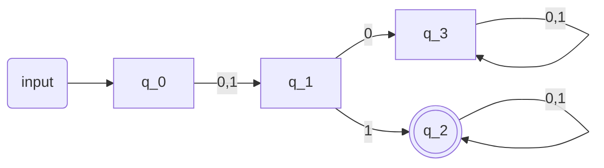
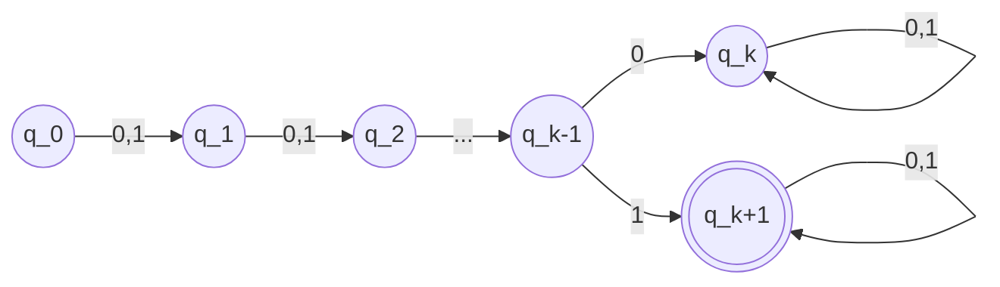
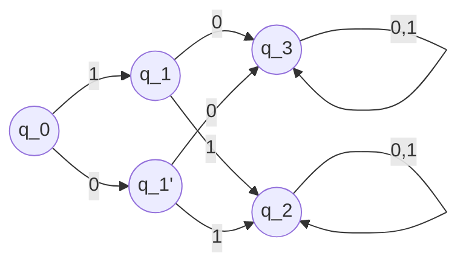

**Question 1:**
Show that a given language, $L$, is not regular

**Question 2:**
(Finitary version:) Show that the minimum number of states in any DFA for $L$ is at least $k$

Consider:
$L_{left2}=\{x \in \{0,1\}^{*}: \text{ the 2nd bit of x (from the left) is 1}\}$
Where
$0100 \in L_{left2}$
$00 \notin L_{left2}$
$0 \notin L_{left2}$
Is there a [[(Deterministic) Finite Automata]] for the language above?

Another question: Is there a 3-state DFA for $L_{left2}$?
No
**Proofs:**
**Method #1:** Enumerate over all 3-state DFAs (all 3 to accept and not accept, can make the less than 100 possible DFAs and check that none of those will result in $L_{left2}$)

Now, lets consider a different language, $L_{leftk}$
$L_{leftk}=\{x \in \{0,1\}^{*}: \text{ the kth bit of x (from the left) is 1}\}$

(Requires k+2 states), but we need a better method of figuring out the optimal number of states.

Using information from [[Distinguishable]],

**Strings:** $\epsilon,0,00,01$ are distinguishable w.r.t $L_{left2}$
$01$ is automatically distinguishable from $0,\epsilon,00$, since you can use the $\epsilon$ to show that $01$ is already in $L_{left2}$

$\epsilon$ and $0$ (choose $z=1 \implies \epsilon z=1 \notin L_{left2},0z=01 \in L_{left2}$)
$0$ and $00$ (choose $z=1 \implies 0z=01 \in L_{left2},001 \notin L_{left2}$)
$\epsilon$ and $00$ (choose $z=11 \implies \epsilon z = 11 \in L, 0011 \notin L$)

Thus, there must be at least 4 states for any DFA.

(Look at photo of DFA), you can have two indistinguishable strings that land in different states. This just shows that the DFA is not optimal

Consider the strings =$\{0^{j}\}$ and $0^{k-1}1$
Then these strings are all pairwise distinguishable with respect to $L_{leftk}$
