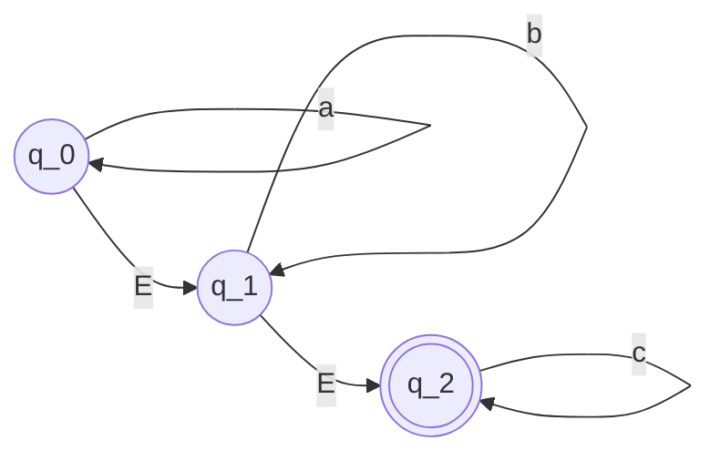

[[Non-Deterministic Finite Automata (NFA)]]
The transition function $\Delta: Q\times(\Sigma \cup \{\epsilon\}) \rightarrow 2^{Q}$

For a given state $q$, define $\epsilon$-closure of $q$ as the set of states reachable from $q$ following $\epsilon$-transitions (0, 1, or more)

N accepts $x$ ($|x|=T$) provided
$\exists q_{0},p_{1},q_{1},p_{2},q_{2},...,p_{T},q_{T},p_{T+1}$
s.t. (i) $q_{0}$ is the start state, $p_{T+1}\in F$
(ii) $\forall 1 \leq i \leq T+1, p_{i} \in \epsilon-closure$ of $q_{i-1}$
$\forall 1 \leq i \leq T, q_{i}\in \Delta(p_{i},x_{i})$