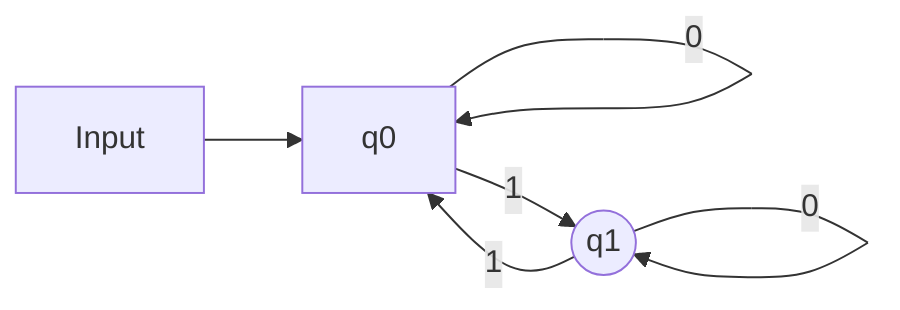
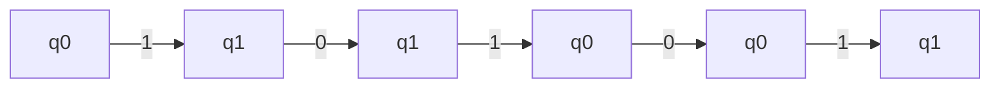
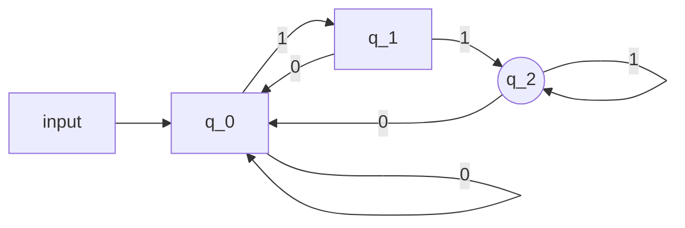
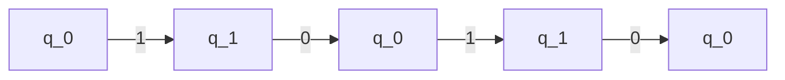

**[[(Deterministic) Finite Automata]]:** Simple model of computation that takes a string and tells you whether it belongs to a language $L$ or not

Ex.

So given input $x = 10101, y=1010$

$M$ is said to accept $x$ if an input $x$, starting at its start state, the computation terminates at an accepting state

**In the above example,** if $q_1$ is said to be an accepting state, then $M$ accepts $x$, $M$ rejects $y$

All accepting states are equal, and we do not care about intermediary steps
In the above example, $M$ accepts $x$ iff $x \in L_{odd}$

From [[(Deterministic) Finite Automata]]:
$Q = \{q_{0},q_{1}\}$
$F=\{q_1\}$
$\Sigma = \{0,1\}$
$\delta(q_{0},0) = q_0$
$\delta(q_{0},0) = q_0$
$\delta(q_{0},0) = q_0$
$\delta(q_{0},0) = q_0$

Example 2 (1/24/24)

$Q = \{q_0,q_1,q_{2}\}, F = \{q_{2}\}, \Sigma\{0,1\}$
$\delta(q_{0},0)=q_0$     $\delta(q_{1},0)=q_{0}$     $\delta(q_{2},1)=q_2$
$\delta(q_{0},1)=q_1$     $\delta(q_{1},1)=q_2$     $\delta(q_{2},0)=q_0$

$x = 0111$
$q_{0}, q_{0}, q_{1}, q_{2}, q_{2}$
$x=1010$

**Claim:** $M_0$ accepts $x$ **if and only if** (iff) $x$ ends in $1$
**Definition:** For a DFA M, $L(M) = \{x \in \Sigma^*: \text{ M accepts x}\}$
	$L(M_{0}) = \{x \in \{0,1\}^{*}: \text{ x ends in 11}\}$

