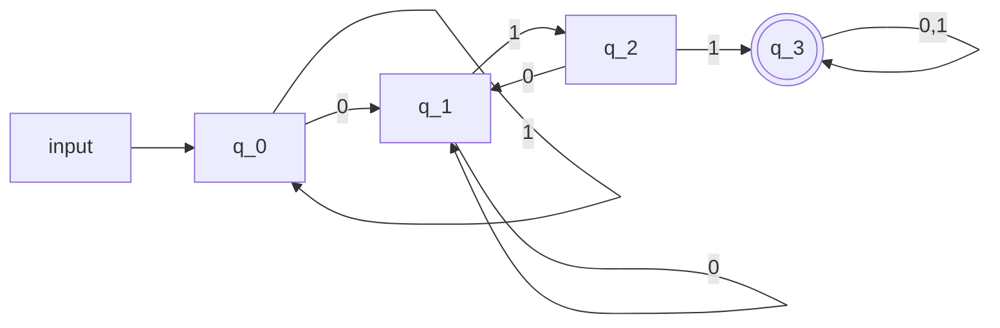

[[Language]] examples:

$L_{011}=\{x \in \{0,1\}^{*}: \text{ x contains 011 as a substring}\}$

$010110 \in L_{011}$
$1010 \notin L_{011}$

The task here is to solve the [[Decision Problem]] by making a [[(Deterministic) Finite Automata]]

$L[M_1]=L_{011}$ (Should include a more formal/rigorous argument. Let's use: [[Extended Transition Function]])
**Why is this a rigorous argument?**

(The automata is functionally equivalent to $L_{011}$, since given an input, $M_1$, we are guaranteed that this will be a part of the language if the automata evaluates to a [[Accepting State]])
