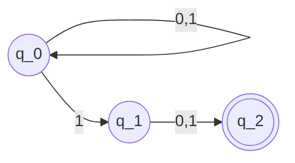
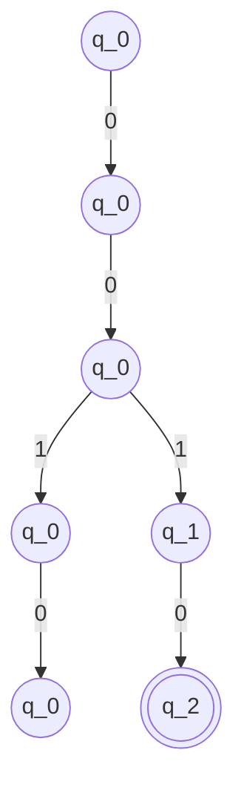
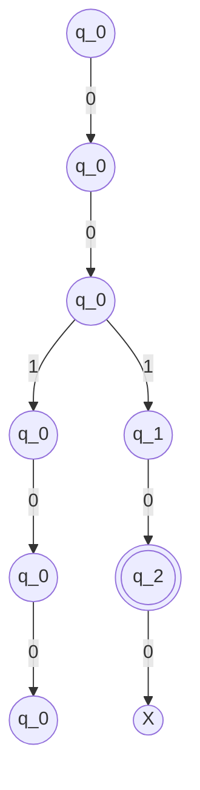
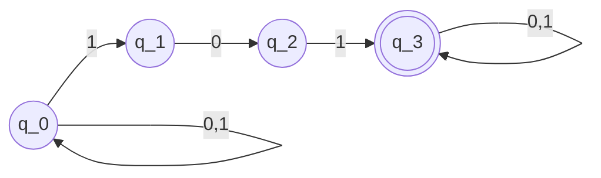

Where each state can have multiple outcomes of the same letter

ex. $x = 0010$, N accepts this string

ex2. $x = 00100$, N rejects this string

Claim: If N accepts x, then 2nd to last bit x is 1
Claim: If the 2nd to last bit of x is 1, then N accepts x
Proof: $x=y1\sigma$, $y \in \{0,1\}^{*}, \sigma \in \{0,1\}$
Consider the thread $q_{0} -y_{1}->q_{0}-y_{2}->q_{0}...-y_{T}->q_{0}-1->q_{1}-\sigma -> q_{2}$
So this means that $N$ accepts $x$

$L(N) = \{x \in \{0,1\}^{*}, \text{ 2nd to last position of x is 1.}\}$

$L(M)=L(N)$, for NFA:
$N=(Q,\Sigma,\Delta,q_0,F)$ (similar qualities as [[(Deterministic) Finite Automata]])
However, the transition function for this NFA takes in 
$\Delta : Q \times \Sigma \rightarrow 2^{Q}$

An NFA accepts $x$ (assume $|x|=T$)
if $\exists q_{0},q_{1},q_{2},...,q_{T}$ s.t.
	(i) $q_0$ is the initial state, $q_{T}\in F$
	(ii) $\forall i, q_{i}\in \Delta(q_{i-1}x_{i}), (1 \leq i \leq T)$

Ex.
$L_{101}=\{x \in \{0,1\}^{*}: x \text{ has the substring } 101\}$

In the execution tree, 
$depth = |x| + 1$
$width \leq |Q|$, the number of possibilities will never exceed the total number of states.

Execution A can be modeled by a DFA provided we keep track of the "subset of states":
$L(M)=L(N)$

$N=(Q,\Sigma,\Delta,q_{0},F)$
$M=(Q',\Sigma,\delta',q_{0}',F')$
$Q'=2^{Q}; q_{0}'=\{q_{0}\}$
$\delta'(A,\sigma)=\cup_{q\in A}\Delta(q,\sigma)$

$F'=\{A: A\cap F \neq \phi\}$

$A$ is just a name for an element/subset of Q

Corollary: Every NFA can be converted to a DFA s.t. if the NFA has $T$ states, the DFA has at most $2^{T}$ states