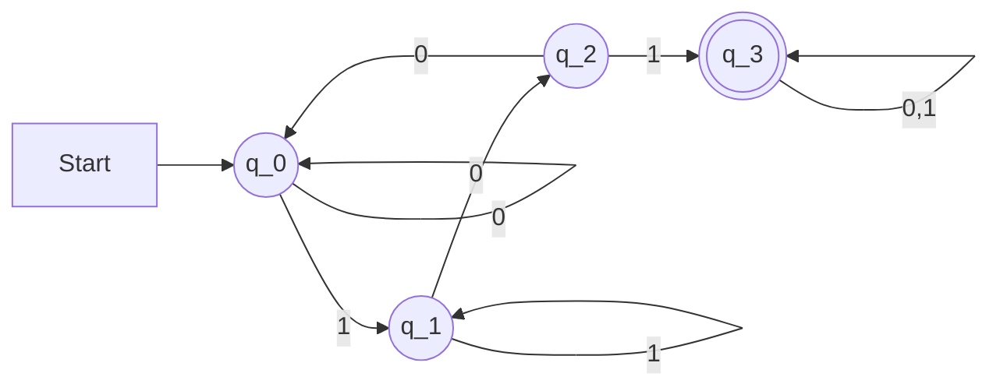
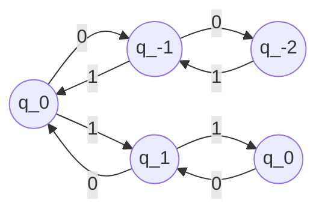

Proof of Correctness for a [[(Deterministic) Finite Automata]]

Problem: Construct a Finite Automata for the following language:
$L_{101}=\{x \in \{0,1\}^{*}: x \text{ has 101 as a substring}\}$

Use $M_0:$

Goal: $L(M_0)=L_{101}$
Proof:
Let $\delta$ denote the transition function of $M_0$
Rewrite the goal: 
For $x \in \{0,1\}^{*}, \delta^{*}(q_{0},x)=q_3$ if and only if $x \in L_{101}$

To prove the above, we will prove an even stronger claim about all the states of the different finite automata.
$\delta^{*}(q_{0},x)=q_{3}$ iff $x \in L_{101}$
$\delta^{*}(q_{0},x)=q_2$ iff $x$ does not have $101$ as a substring and the last $2$ bits are $10$
$\delta^{*}(q_{0},x)=q_1$ iff $x$ does not have $101$ as a substring & the last position is $1$
$\delta^{*}(q_{0},x)=q_{0}$ iff $x$ does not fall in any of the above groups

To prove for all $x$, run induction on the length of $x, |x|$
**Base Case:** $|x|=0 \iff x = \epsilon$
$\delta^{*}(q_0,x)=q_{0}$ here, $x$ falls in the last group (follow DFA)
Thus, the Base Case is verified.
**Induction Hypothesis:** WTS $x=y\sigma$ holds for the Language
	where $y \in \{0,1\}^{*}, \sigma \in \{0,1\}$ and
	$\delta^{*}(q_{0},y) \in \{q_{0},q_{1},q_{2},q_{3}\}$
**Induction Step:**
	**Case 1:** $\delta^{*}(q_{0},y)=q_{0}$ and $\sigma = 0$
	$\implies y \notin L_{101}$ & its last 2 positions are not $10$ & last bit is not $1$
	$x=y\sigma$ also falls in the last group
	$\delta^{*}(q_{0},x) = \delta(\delta^{*}(q_{0},y),\sigma)$
	$=\delta(q_{0},0)=q_{0}$
	**Case 2:** $\delta^{*}(q_{0},y) = q_{0},\sigma = 1$
	y falls in the last group.
	$x = y1$ $\implies$ x falls in Item 3
	i.e. the last position of $x$ is $1$ but $x \notin L_{101}$
	$\delta^{*}(q_{0},x)=\delta(\delta^{*}(q_{0},y),\sigma)$
	$=\delta(q_{0},1)=q_{1}$
*Partially finished:* Six remaining cases need to be verified

**Example:** Construction of a Finite Automata
2. A string $x \in \{0,1\}$ is said to be $c-balanced$ iff for any position $i$, the substring starting at position $1$ & ending at $i$ satisfies 
$|\text{ the number of 0s - the number of 1s }| \leq c$
(e.g. suppose $c=3$)
$x \in \{0,1\}^{*}$ is $3$-balanced
$100101001$

For any $c$, define $L_{c}=\{x \in \{0,1\}^{*}: x \text{ is c-balanced}\}$. Prove that there is a DFA $M_{c}$ s.t. $L(M_{c})=L_{c}$

Problem:
Can you construct an automata for the following?
$L_{1}=\{x \in \{0,1\}^{*}: |\text{ the number of zeroes in x - the \# of 1s}| \leq 1\}$
$L_1$ has no DFA