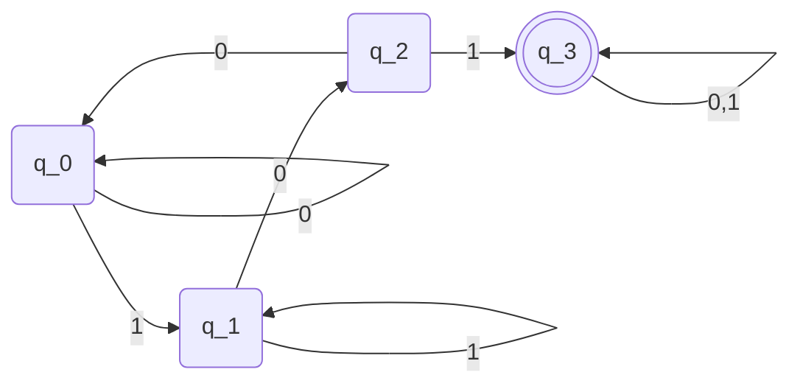

$L_{left,k}:= \{x \in \{0,1\}^{*}: \text{ the kth bit from the left in x is a 1}\}$
In the lecture, we had demonstrated that there is a $k+2$ state DFA for $L_{left,k}$

**Goal:**
Any DFA for $L_{left,k}$ must have at least $k+2$ states
(Need to find $k+2$ pairwise distinguishable states).
Try: $S=\{\epsilon,0,00,...,0^{k},0^{k-1}1\}$

**Claim:** Any 2 strings in S are distinguishable w.r.t. $L_{left,k}$

**Goal:** Show that any $2$ strings in $S$ are pairwise distinguishable w.r.t $L_{left,k}$
(Recall that $x,y$) are distinguishable w.r.t $L$ if $\exists z$ exactly one of $xz$ and $yz$ is in $L$

**Observation:** $0^{k-1}1 \in L_{left,k}$ & $0^{j} \notin L_{left,k}$ for $0 \leq j \leq k$
Thus, $0^{k-1}1 \& 0^{k}$ are distinguishable

**(Sub)Claim:** For any $i \neq j (0 \leq i, j \leq k)$,
$0^{i}\& 0^j$ are distinguishable
(wlog, $i < j$). Find $az$ s.t. $0^{i}z \notin L_{left,k},$ $0^{j}z \in L_{left,k}$
Let $z=1^{k-j}$, then
$o^{j}z=0^{j}1^{k-j} \in L_{left,k}$
$0^{i}z=0^{i}1^{k-j}\notin L_{left,k}$
*This does not work for k=j, since we are not appending any 1s*, try:
(wlog, $i < j$). Find $az$ s.t. $0^{i}z \in L_{left,k},$ $0^{j}z \notin L_{left,k}$
Let $z=0^{k-(i+1)}1$, then
$o^{j}z=0^{j}0^{k-(i+1)}1 = 0^{k+j-(i+1)}1 \notin L_{left,k}$
$0^{i}z=0^{i}1^{k-(i+1)}1=0^{k-1}1\in L_{left,k}$
as $k+j-(i+1) \geq k$
$L_{101}=\{x \in \{0,1\}^{*}: \text{ x has 101 as a substring}\}$

*Goal: Try to find set of distinguishable strings:*
$S = \{\epsilon, 1, 10, 101\}$
$\epsilon$ and $1$
$z=01, \epsilon 01 = 01, 101 \in L$
$1, 10$
$z = 1$
$\epsilon$ and 10
$z=1$

Let $L$ and $L'$ be regular languages. For any $2$ strings $x,y \in \Sigma^{*}$ of the same length, $Int(x,y):=x_{1}y_{1}x_{2}y_{2}...x_{n}y_{n}$
$N = |x|$
Define $L^{0}=\{z:z=Int(x,y) \text{ for some } x \in L and y \in L'\}$. Prove that $L^{0}$ is regular
Let $M=(Q,\Sigma,\delta,q_{0},F)$ be a DFA for $L$
$M'=(Q',\Sigma,\delta',q_{0}',F')$ be a DFA for $L'$
For $L^0$, $Q_{0}$ is the states of $L^{0}$. Thus, $Q_{0}=Q \times Q' \times \{0,1\}$
$q_{0}^{0}=(q_{0},q_{0}',0)$
$\delta_{0}: Q_{0}\times \Sigma \implies Q_{0}$
$\delta_{0}((p,q,i),\sigma)$
$$
=\cases{\delta(p, \sigma),q,1 \tag{i=0, i=1 respectively}
\\(p,\delta'(q,\sigma),0))}
$$
