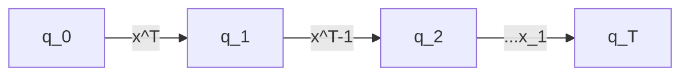
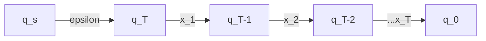
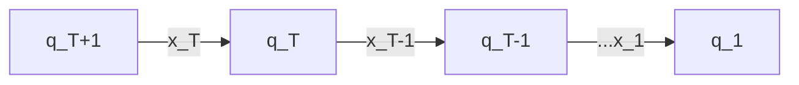

**Example:**
Given a Language $L$, define $L^{R}=\{x:x^{R} \in L\}$
For a string x, $x^{R}$ is its reverse
If $x = 1100$, $x^{R}=0011$

**Claim:** If $L$ is regular, so is $L^{R}$
**Proof:** Let $M = (Q, \Sigma, \delta, q_{0}, F)$ be the DFA for $L$.
*Big idea: DFA might not be most efficient for the $L^{R}$, since the accepting states of $L$ need to be the start states for $L^{R}$, but there are multiple accepting states, so need to make an NFA*.

$N=(Q', \Sigma, \Delta, q_{s}, F')$
$Q' = Q \cup q_{s}$
$F' = \{q_{0}\}$
$\Delta(p,\sigma) = \{q: \delta(q,\sigma) = p\}$
$\Delta(q_{s},\epsilon)=\{q_{f}:q_{f} \in F\}$
$\Delta(q_{s},\sigma)=\phi$

**Claim 1:** $L^{R} \subseteq L(N)$
**Proof:** $x \in L^{R} \iff x^{R} \in L$
If $x = x_{1}x_{2}...x_{T}$,
$x^{R}=x_{T}...x_{2}x_{1}$

$\in F$ (DFA M)

In the NFA N, here's an accepting path.

$q \in \Delta(p, \sigma)$ (if $\delta(q,\sigma)=p$)
(NFA N)

This is an accepting path in the NFA N

**Claim 2:**
$L(N) \subseteq L^{R}$
Suppose $x$ is accepted by $N$
Then $x$ must have an accepting path in $N$.
Every accepting path in $N$ is of the form

$q_{1} \in F_{j}, q_{T+1} \in q_{0}, \forall i q_{i+1}\in \Delta(q_{i},x_{i}) \iff \delta(q_{i+1},x_{i}) = q_{i}$

$q_{0}=$

$\in F$

$x_{T}x_{T-1}...x_{1} \in L(M) = L$
$\implies x^{R} \in L \iff x \in L^{R}$

Suppose $M$ is a DFA
**Definition:**
We say that the two states $p \;\&\; q$ are indistinguishable in $M$ if $\forall z \in \Sigma^{*},$ either both $\delta^{*}(p, z)$ & $\delta^{*}(q,z)$ are in $F$ or neither is

**Observation:** If $p \in F$ & $q \notin F$, then $p \;\&\; q$ are distinguishable

**Claim:** Suppose $p,q,p',q'$ are s.t. $\exists z, \delta^{*}(p',z)=p$
$\delta^{*}=q$ & $p \;\&\; q$ are distinguishable. Then so are $p',q'$.

**Proof:**
$\exists x \; s.t. \;\delta^{*}(p,x) \in F \;\&\; \delta^{*}(q,x) \notin F$ (or vice-versa)
$\delta^{*}(p',z)=p \implies \delta^{*}(p',zx)=\delta^{*}(\delta^{*}(p',z),x) \in F$
$\delta(q',z)=q \implies \delta^{*}(q',zx) = \delta^{*}(\delta^{*}(q',z),x) \notin F$

**Definition:**
Let's say that $p \;\&\; q$ are distinguishable by strings of length $i$.
$if \;\exists z$ of length $i$ s.t.
$\delta^{*}(p,z) \in F \;\&\; \delta^{*}(q,z) \notin F$ (or vice versa)

**Claim:** If $p \& q$ are distinguishable states, then they must be distinguishable by a string of length $n$ (or less) where $n=|Q|$.

Suppose