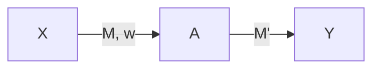

& Proof that $A_{\Phi}=\{<M>:L(M) \neq \phi\}$ is undecidable

Defn: We say $L_{1}\leq L_2$ if $\exists$ a halting program P s.t. $\forall x, x\in L_{1}\iff P(x) \in L_2$
Claim: If $A_{TM} \leq L,$ then $L$ is undecidable
Claim: If $\bar{A_{TM}}\leq L,$ then $L$ is not r.e.

Let $A_{TM}=\{<M>,w:M \text{ accepts } w\}$

$L_{infinite}=\{<M'>:L(M') \text{ is an infinite set}\}$
	Claim: $L_{infinite}$ is undecidable
	To prove this, we will reduce $A_{TM}$ to $L_{infinite}$

$M$ accepts $w$ --> $L(M')$ is infinite
$M$ does not accept $w$ --> $L(M')$ is finite

$M'(x)$ {
1. Run $U_{TM}$ on $<M>,w$
2. If $U_{TM}$ accepts, accept x,
3. else reject x
}

If $M$ accepts $w$ $\implies$ Line 1 halts & accepts & thus in line 2, x is accepted. $L(M') = \Sigma^{*}$ & thus an infinite set

If $M$ doesn't accept $w$:
Case 1: $M$ doesn't halt on $w$, then Line 1 does not halt, so $L(M')=\Phi$
Case 2: $M$ rejects $w$, then Line 1 halts & rejects. Line 3 rejects $x$, $L(M')=\bar{\Phi}$

$U_{TM}$ on $<M>, w$
- accepts if $M$ accepts $w$
- rejects if $M$ rejects $w$
- does not halt if $M$ does not halt on $w$

If $M$ accepts $w \implies M'(x)$ {
1. accept x,
}

If $M$ does not accept $w \implies M'(x)$ {
1. reject x,
}

$L_{finite} = \{<M>:L(M) \text{ is a finite set}\}$
Claim: $L_{finite}$ is not recursively enumerable
We will show that $\bar{A_{TM}} \leq L_{finite}$

$M$ does not accept $w$ --> $L(M')$ is a finite set
$M$ accepts $w$ --> $L(M')$ is an infinite set
[Same reduction follows]

Claim: $L_{infinite}$ is not recursively enumerable
Proof: We will reduce $\bar{A_{TM}}$ to $L_{infinite}$

$M$ does not accept $w$ --> $L(M')$ is infinite
$M$ accepts $w$ --> $L(M')$ is finite

$M'(x)$ {
1. Run $U_{TM}$ on $<M>$, $w$ for $|x|$ steps
2. If $U_{TM}$ accepts, reject x
3. else accept x
}

Observation 1: Program $M'$ halts on every input $x$
Observation 2: If $M$ does not accept $w$, $L(M')=\Sigma^{*}$.
Proof: Line 1 always halts. If $M$ does not accept w.
Line 2 is not executed & thus $x$ is accepted by Line 3

Observation 3: If $M$ accepts $w$, $L(M')$ is finite
Proof: Let $M$ accepts $w$ in $T_{0}$ steps. Any string $x$ of length $\geq T_0$ is rejected

