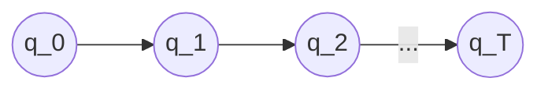

$L^{*}=\cup_{k \geq 0} L^{k}$
Example:
$L={00,11}$,
then $L^{*}$ consists of [[String]]s of the form $a_{1},a_{2},...,a_{s}$ where $s \geq 0$ & each $a_{i}$ is either $00$ or $11$
$L^{*}=\epsilon \cup L \cup L^{2} \cup L^{3} \cup...$
For every $i$, $L^{i}= \{x^{(1)},x^{(2)},...,x^{(i)},x^{(1)},x^{(2)},...,x^{(i)}, \in L\}$

$L=\{0,1\}$
$L^{*}=\{0,1\}^{*}$

**Thm.** If $L$ is regular, so is $L^{*}$
**Proof:** Let $M=(Q,\Sigma,\delta,q_0,F)$ be the DFA for $L$.
Then define an Epsilon-NFA $N := (Q, \Sigma, \Delta, q_{0}, F)$
$\Delta(q,\sigma)=\delta(q,\sigma)$
$$\Delta(q,\epsilon) = \cases{q_{0}if \; q \in F \\ \phi \; if \; q \notin F}$$

**Claim:** $L(N) = \cup_{k \geq 1} L^{k}$
WTS $\cup_{k\geq1}L^{k}\subseteq L(N)$
**Proof:** Suppose $x \in \cup_{k \geq 1}L^{k} \implies x=z^{(1)}z^{(2)}...z^{(s)}$ for some $s \geq 1$ where each $z^{(i)}\in L$
Then $\forall 1 \leq i \leq S, \delta^{*}(q_{0},z^{(i)}) \in F$
Let $p_{i}=\delta^{*}(q_{0},z^{(i)})$
Consider the following path for $x \rightarrow q_{0} --> p_{1}$

Since $z^{(1)}...z^{(s)} = x \implies x \in L(N)$
Since epsilon is a regular language, then the whole union of $L^{*}$ is regular
*Note: $k$ cannot be infinity, this machine is FINITE, so it can be arbitrarily large, but not infinity*

In the above, we have proven that $L(N) = \cup_{k \geq 1} L^{k}$
Now, need to prove that $L(N) \subseteq \cup_{k \geq 1}L^{k}$
Suppose $N$ accepts x
Consider an accepting path for $x$

$q_0$ is a starting state
$q_{T} \in F$. Let's assume that $q_{i_{1}} --\epsilon --> q_{i_{1}+1}$
$q_{i_{2}} --\epsilon --> q_{i_{2}+1}$
...
$q_{i_{s}} --\epsilon --> q_{i_{s}+1}$

Thus, due to how we constructed the NFA,
$q_{i_{1}+1}=q_0$
$q_{i_{2}+1}=q_0$
...
$q_{i_{s}+1}=q_0$

$q_{i_{1}} \in F$
$q_{i_{2}} \in F$
$q_{i_{s}} \in F$

Let $z_0$ be the string read between $q_{0}$ and $q_{i_{1}}$
Let $z_{1}$ be the string read between $q_{i_{1}+1}$ and $q_{i_{2}}$
...
Let $z_{s-1}$ be the string read between $q_{i_{s-1}+1}$ and $q_{i_{s}}$
Let $z_{s}$ be the string read between $q_{i_{s}+1}$ and $q_{T}$

$\delta^{*}(q_{0},z_{0})=q_{i_{1}} \in F \implies z_{0} \in L$
$\delta^{*}(q_{i_{1}+1}, z_{1})=q_{i_{2}} \in F \implies z_{1}\in L$
...
$z_{s}\in L$

Thus,
$x = z_{0}...z_{s} \in L^{s}\in \cup_{k \geq 1}L^{k}$
