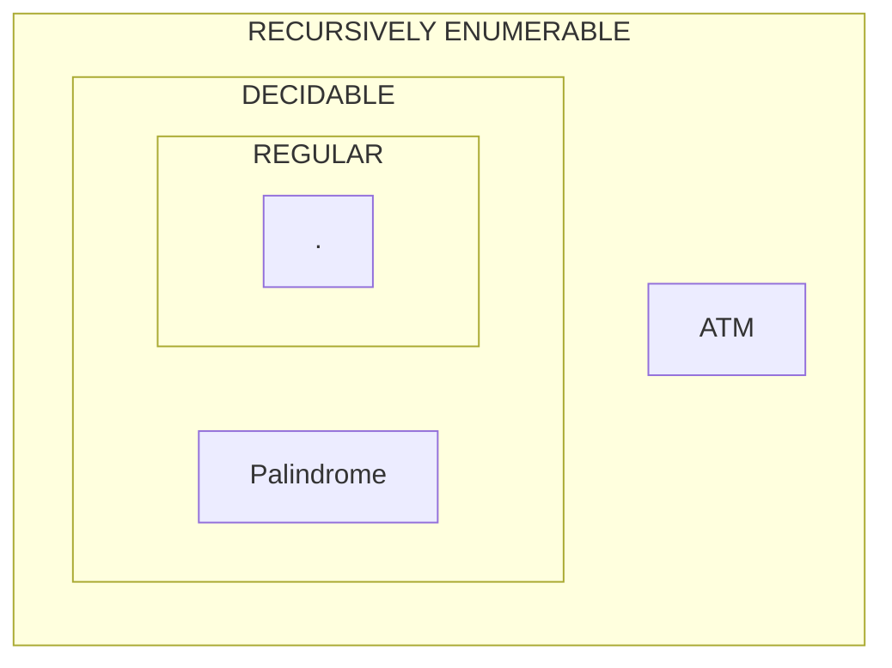

Recap: $U_{TM}$ is the Universal $TM$ which on input (\<M\>, w):
1. accepts if $M$ accepts $w$
2. rejects if $M$ rejects $w$
3. does not halt if $M$ does not halt on $w$

$A_{TM}$ is a set of pairs where the first element is a code of a Turing machine and the second element is a string
$A_{TM}=\{<M>,w:M \text{ accepts w}\}$
$L(U_{TM})=A_{TM}$
Thus $A_{TM}$ is recursively enumerable

**Claim:** If $L$ & $\bar{L}$ are both r.e, then $L$ is decideable
**Proof:** Let $M$ (resp. $M'$) be TMs for $L$ (resp. $\bar{L}$).
$L = L(M)$ and $\bar{L}=L(M')$.
$$M''(x) \cases{
1. T <- 1\\
2. \text{Run M on x for T steps, if M accepts, accept}\\
3. \text{Run M' on x for T steps, if M' accepts, reject}\\
4. T < T+1,\text{ go to Step 2}
}
$$
**POC:**
**Claim:** If $x \in L$, $M''$ accepts $x$
**Proof:** If $x \in L$, $M$ accepts $x$ in some $T_{0}$ steps. Line 3 will never reject $x$. Thus, eventually, when $T = T_{0}$, in Line 2, $M$ will accept $x$ and thus $M''$ will accept $x$.
Line 3 never rejects $x$ because $x$ is a part of $L$, and $M'$ is a language for the complement, $\bar{L}$.

**Claim:** If $x \in \bar{L}$, then $M''$ will reject $x$.
$\implies L(M'')=L$ and $M''$ halts on every input
$\implies L$ is decideable

Since $A_{TM}$ is r.e. but not decidable $\implies A_{TM}$ is not r.e.

$\bar{A_{TM}}=\{<M>,w: M \text{ does not accept } w\}$
"If you know how to add, you know how to multiply"
Multiplication reduces to addition
Multiplication $\leq$ Addition

**Definition:** $L_{1}\leq L_{2}$ ($L_{1}$ reduces to $L_{2}$)
if $\exists$ halting program $P$ s.t. $x \in L_{1}$ iff $P(x) \in L_{2}$

