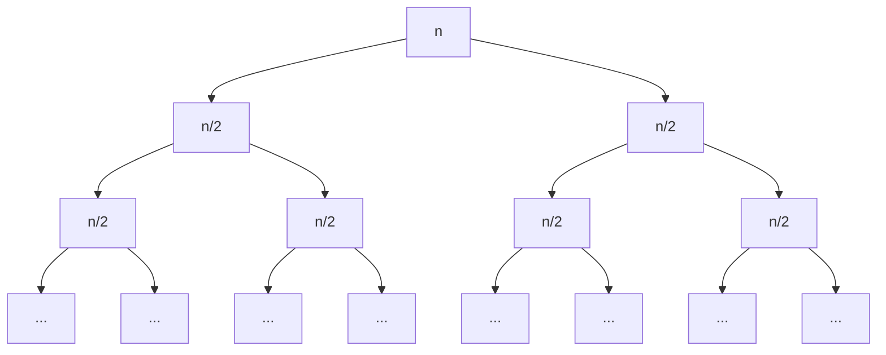
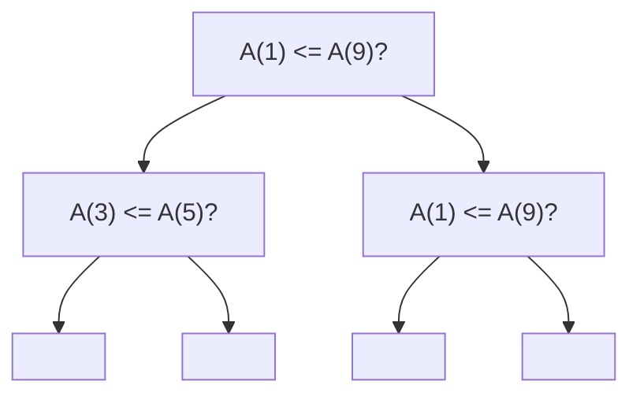

**Agenda (Brief Review of Sorting Algorithms)**
- Divide & Conquer Paradigm
- Randomization to avoid adversarial behavior
- Data structures to speed-up book-keeping
- Limitations of Comparison Sort
- Non-Comparison Sorts

## Mergesort
- *Input:* An array $A[1\dots n]$
- *Goal:* Output elements of $A$ in sorted order
- *Strategy:*
	- Take the array and split into half portions
	- Then merge into a single sorted algorithm
```Python
def Mergesort(A, p, r): # Sort the subarray A[p...r]
	if p < r:
		Mergesort(A, p, Math.floor((p+r)/2))
		Mergesort(A, Math.floor((p+r)/2))
		# Merge the 2 sorted halves

print("Hello")
```

___Analyzing runtime:___
- Write the **recurrence relation**
$$\begin{align*}
T(n) &= 2T\left( \frac{n}{2} \right)+O(n)\\
&= O(n\log n)
\end{align*}$$


- We have $O(\log n)$ levels for your division algorithm
- In the first level, $n$, there is a constant $c$ amount of work per element to make $cn$ time
- In the second level, for each subarray of size $\frac{n}{2}$, there is a constant $c$ amount of work done for $2$ subarrays, so still $\frac{cn}{2} + \frac{cn}{2} = cn$ amount of work being done

**Divide & Conquer Paradigm**
- Divide (Create smaller subproblems)
- Conquer (Recursively solve smaller subproblems)
- Combine (Combine solutions to smaller subproblems)

___Mergesort Time Spent in the context of Divide & Conquer Paradigm___
- Divide step: $O(1)$ (just computing the midpoint)
- Conquer step: $2T\left( \frac{n}{2} \right)$
- Combine step: $O(n)$
- Thus, $T(n) = 2T\left( \frac{n}{2} \right) + O(n) + O(1)$
- So calculating recurrence allows calculating of runtime

## Quicksort
- **Idea:** Choose a pivot element $x$, and recursively sort by placing elements less than ahead and elements greater than after

**Partition:**
- Will place a number in its place and sort around it whether it is greater than or less than
- $q$ = index at which $x$ sits after the partition

```Python
def QSort(A, p, r):
	if p < r:
		q = Partition(A, p, r)
		QSort(A, p, q - 1)
		QSort(A, q + 1, r)

def Partition(A, p, r):
	
```

**How to choose a pivot?** 
- *Idea 1:* Just pick the first element in the array as you pivot
- $T(n) = T(n - 1) + O(n)$
	- $= O(n^{2})$ time (Worst case)
- *Idea 2:* Choose a random element in the array as the pivot
	- If we say that the pivot will be chosen from an array a's middle $\frac{n}{4}$ to $\frac{3n}{4}$ elements, the worst case recurrence is 
	- $T(n) = T\left( \frac{n}{4} \right) + T\left( \frac{3n}{4} \right) + O(n)$
	- Choosing between these two occurs with probability $\frac{1}{2}$
	- e.g. The expected number of times you need to flip a coin to get heads is 2 (geometric distribution, where $E(x) = \frac{1}{p} = \frac{1}{\frac{1}{2}} = 2$)
	- So every 2 times, you are expected to land in the range
	- Intuitively, this means that your array is "conquered" in log time

## SelectionSort
```Python
def SelectionSort(A, 1, n):
	for i in range(n, 2, -1): # For i from n down to 2
		# Find the largest element in A[1...i]
		# Swap it with the element A[i]
```
- Because we don't have any memory in this case, need $O(n^2)$ time

## Binary Heap
- Max Heap

**Step 1: Build Heap**
- $O(n)$ time

**Step 2: Extract Max**
- $O(1)$ time

**Step 3: Heap Increase Key**
- $O(\log n)$ time

## HeapSort
- Combination of Selection Sort + Binary Heaps
- $O(n\log n)$ runtime

## Comparison Sorts
**Theorem:** Any comparison sort requires $O(n\log n)$ comparisons in the worst case
**Proof:**
Use a decision tree, where each node compares two elements in an $A[1\dots n]$ array

- In order for the decision tree to be definitive, we need there to be $n!$ **total leaves** (the final array ordering that we reach i.e. (A(3), A(1), A(2), A(0), ...)) **in the bottom row**
- The worst-case runtime is $h$, the height of the decision tree
- A binary tree of height $h$ has $\leq 2^h$ leaves
- **Final Observation:** $2^{h} \geq n!$
	- $h \geq \log(n!) = \Omega (n\log n)$
	- Because $n! \geq \left( \frac{n}{2} \right)^{\frac{n}{2}}$

## Count Sort
- **Input:** An array $A[1\dots n]$ such that all elements in $A$ are in the range $[1\dots k]$
- **Goal:** Sort $A$ in $O(n + k)$ time
- **Algorithm:**
```Python
def CountSort(1...k):
	# Initialize an array C[1...k] to all 0's
	for i in range(1, n, 1):
		C[A[i]] = C[A[i]] + 1

	for i in range(1, k, 1):
		# Output i for C[i] times
```
- Initializing an array takes at worst $O(k)$ time
- First for loop occurs in $O(n)$ time
- Second for loop occurs in $O(n + k)$ time

