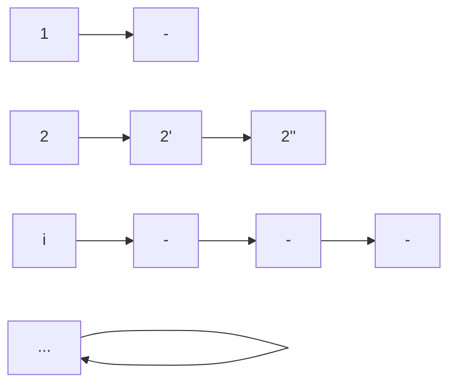

### Count Sort
*Input:* An array $A[1\dots n]$ of integers in the range $[1\dots k]$
*Goal:* Sort in $O(n+k)$ time

```Python
# Initialize an array C[1...k] to all 0's
for i in range(1, n + 1):
	C[A[i]] = C[A[i]] + 1
for i in range(1, k + 1):
	# output "i" for c[i] times
```

### Stable Count Sort
$A=3', 1, 2, 4', 3'', 4''$
Stable Sorted Order $= 1, 2, 3', 3'', 4', 4''$
*Implementation:* Use a linked list, where each element from 1 to k is an element in a hashmap, then point to each element. Output is the element from left to right order in the linked list

### Radix Sort
*Suppose $k=n^2$*
**Step 1:** Stable count sort $A$ based on lower order $\log n$ bits
**Step 2:** Stable count sort based on the higher order $\log n$ bits

Takes $O(n)$ time total

___Useful using stable count sorting to first order the lower bits so that they are relatively sorted, then use the higher order log n bits to definitely order the larger and smaller elements differently___

**Proof**
- Consider any 2 elements $A_{i}, A_{j}$
	- $A_{i}$ and $A_{j}$ differ in higher order $\log n$ bits (step 2 handles this)
	- $A_{i}$ and $A_{j}$ only differ in lower order $\log n$ bits

**Suppose** we are given an array $A[1\dots n]$ of integers in the range $a - n^d$ for some integer $d \geq 1$. Then we can sort them in $O(dn)$ time

## Selection Problem
*Input:* An array $A[1\dots n]$ and an integer $r \in [1\dots n]$
*Goal:* Output the element of rank $r$ in $A$.

**A Canonical Algorithm**
- Choose an element $x$ in $A$ as pivot
- Partition $A$ around $x$
- If $r = q$, then return $x$
- If $r < q$ or $r > q$, then recursively search for element of rank $r$ in $L$

**Scenario 1:** Pivot is always the median element
$T(n)=T\left( \frac{n}{2} \right)+O(n)$
$=O(n)$

**Scenario 2:** Pivot is always an element of rank in the range$\left[ \frac{n}{4}, \frac{3n}{4} \right]$
$T(n)=T\left( \frac{3n}{4} \right) + O(n)$
We will achieve scenario $2$ in $O(n)$ time deterministically

```python
def select(A, r):
	# Partition the elements of A into math.floor(n/5) groups of 5 elements each, say g1, g2, ..., g_(math.floor(n/5))
	# Find the median element in each group Gi, let mi denote the median in Gi
	# Create a new array M of size math.floor(n/5) that contains m1, m2, ..., m_(math.floor(n/5))
	# Call select(M, math.floor(n/10)); let m* be the element returned
	# Use m* as the pivot in the canonical algorithm and continue as explained earlier
```

Q1: How good a pivot is $m*$?
Q2: What is the total time taken by this algorithm?

#### Rank of m*
**Observation:** $m*$ is greater than or equal to at least $3\left\lfloor  \frac{n}{10}  \right\rfloor$

Rank of $m*$ is at least $3\left\lfloor \frac{n}{10} \right\rfloor$
Note that $3\left\lfloor  \frac{n}{10}  \right\rfloor \geq \frac{n}{4}$ for $n \geq 60$

A similar argument shows that rank of $m*$ is $\leq \frac{3n}{4}$
=> Rank of $m*$ is in the range $\left[ \frac{n}{4}, \frac{3n}{4} \right]$

#### Runtime Analysis
- Partitioning and initial median calculation takes $O(n)$
- New array creation of array M takes $O(n)$
- Calling select recursively takes $T\left( \frac{n}{5} \right)$
- Use $m*$ as the pivot

$T(n) = T\left( \frac{3n}{4} \right) + T\left( \frac{n}{5} \right) + O(n)$
**Substitution Method**
- We will show $T(n) \leq cn$ for some constant $c$
- **Base Case:** $n \leq 60$. Choose $c$ to be large enough to cover the runtime for iterations of size $\leq 60$
- **Inductive Step:** Assume that for all $n' < n$, we have $T(n') \leq cn'$
	- $T(n)=T\left( \frac{3n}{4} \right) + T\left( \frac{n}{5} \right) + c_{1}n$
	- $\frac{3cn}{4} + \frac{cn}{5} + c_{1}n$
	- $= \frac{19cn}{20} + c_{1}n \leq cn$ (This is what we need)
	- $c \geq 20c_{1}$

