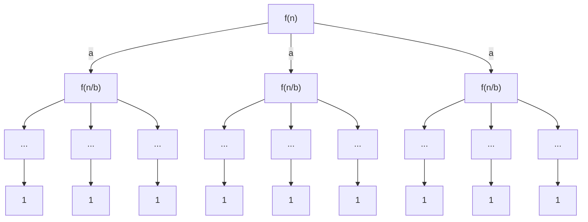

## Master Theorem
- $T(n)=aT\left( \frac{n}{b} \right) + f(n)$
- $a \geq 1, b > 1, f(n)$ is non-negative
### Visualization

- Layer 1 takes $f(n)$
- Layer 2 takes $af\left( \frac{n}{b} \right)$
- Layer 3 takes $a^2f\left( \frac{n}{b^2} \right)$
- Total layers $\log_{b}n$

### Calculations
$\#\;of\;leaves = a^{\log_{b}n}=n^{\log_{b}a}$
$Total\;Work\;Done = f(n) + \theta(n^{\log_{b}a}) + \sum_{j=1}^{\log_{b}n-1}a^{j}f\left( \frac{n}{b^{j}} \right)$
- $f(n)$: Total work done at the root
- $\theta(n^\log_{b}a)$: