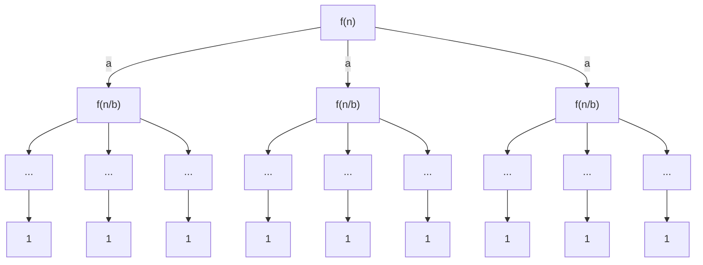

## Master Theorem
- $T(n)=aT\left( \frac{n}{b} \right) + f(n)$
- $a \geq 1, b > 1, f(n)$ is non-negative
### Visualization

- Layer 1 takes $f(n)$
- Layer 2 takes $af\left( \frac{n}{b} \right)$
- Layer 3 takes $a^2f\left( \frac{n}{b^2} \right)$
- Total layers $\log_{b}n$

### Calculations
$\#\;of\;leaves = a^{\log_{b}n}=n^{\log_{b}a}$
$Total\;Work\;Done = f(n) + \theta(n^{\log_{b}a}) + \sum_{j=1}^{\log_{b}n-1}a^{j}f\left( \frac{n}{b^{j}} \right)$
- $f(n)$: Total work done at the root
- $\theta(n^{\log_{b}a})$: Work done at the intermediate levels
- $\sum_{j=1}^{\log_{b}n-1}a^{j}f\left( \frac{n}{b^{j}} \right)$: Work done at the intermediate levels

### Cases

#### Case 1:
- Work done at the leaves is "much larger" than the work done at the root. 
- $\exists \epsilon > 0\;s.t.f(n)=O(n^{\log_{b}a-\epsilon})$
- Then $T(n)=\theta(n^{\log_{b}a})$

#### Case 2:
- Work done at the leaves $\approx$ work done at the root
- $f(n)=\theta(n^{\log_{b}a})$
- $T(n)=\theta(f(n)\log n)$

#### Case 3:
- Work done at the root is "much larger" than the work done at the leaves
- $\exists \epsilon > 0\;s.t.f(n)=\Omega(n^{\log_{b}a-\epsilon})$
- $T(n)=\theta(f(n))$
- **Regularity Condition:**
	- $\exists c < 1\;s.t.af\left( \frac{n}{b} \right) \leq cf(n)$

### Examples
- $T(n)=aT\left( \frac{n}{4} \right)+n$
- Solve this recurrence for $a=3,4,5$
- When $a=5$, grows larger for leaves, because creating 5 recurrences where they cumulatively do $\frac{5n}{4}$ extra work per

### Dictionary Data Type
- You have a universe $U$ with a subset $S$ of $n$ keys
- This dynamic set will allow you to do 3 functions:
	- $Insert(k)$
	- $Delete(k)$
	- $Find(k)$
- How would you make this in code?

#### Approach 1:
- Create a Boolean table $T$ of size $M$, initialized to False
- $Insert(k)$: Set $T[k]=True$
- $Delete(k)$: Set $T[k]=False$
- $Find(k)$: Return $T[k]$
- $O(1)$ time
- But $O(M)$ space usage, so very ineffective if Universe is large (e.g. $M=(26)^{200}$)

#### Approach 2:
- Map each key from the set to a $m-1 \ll M$ size table $T$
- U --> [0, 1, ..., M-1]
- **Chaining to handle collisions:** When two elements in the list are mapped to the same slot, deal with it using a linked list
- ___Observation:___ When dealing with the linked list approach, our dream size for each linked list in each table slot would be $\frac{n}{m}$ (i.e. the length of the linked list of all $n$ elements were evenly distributed amongst $m$ slots)
- If we achieve this then Ins/Del/Find take $O\left( 1 + \frac{n}{m} \right)$ time
- **Pick a random hash function:**
- function
	- h: {0, 1, ..., M-1}
		- --> {0, 1, ..., m-1}
	- Expected linked list size is $\frac{n}{m} \implies O(1)$ expected time/operation if we set $m=n$ \left(**otherwise** $O\left( 1 + \frac{n}{m} \right)$ expected time)
	- $1, 2, \dots, N$: $\log N$ bits
	- \# of hash functions $N=m^M$
	- $\log N=M \log m$ bits

#### Approach 3:
- We will achieve the performance of Approach 2 using a hash family $H$ that has $O(M^2)$ hash functions

___Universal Hash Family___
- Fix any positive integer $m$. Let $H$ be any collection of hash functions such that each hash function $h \in H$ is of the form $h: \{0, 1, \dots, M-1\}\to\{0, 1, \dots, m-1\}$
- Then, we say that $H$ is a universal hash family if for any $2$ distinct keys $k, l \in U$, we have
	- $|\{h \in H\;s.t.\;h(k)=h(l)\}| \leq \frac{|H|}{m}$

**Theorem:** For every positive integer $m$, there exists a universal hash family of size $O(M^2)$

**Claim:** Fix any key $k$ in the universe $U$. Suppose we hash a set $S$ of $n$ keys using a hash function $h$ chosen uniformly at random from a universal hash family $H$ with table size $m$. Then expected \# of elements in $S$ that collide with $k$ is $\leq \frac{n}{m}$
**Proof:** Define a random variable $C_{k}=\text{\# of keys in S that collide with k}$
- $C_{k}=\sum_{l\in S}C_{kl}$ where $C_{kl}$ is an indicator random variable that is 1 if $l \in S$ collides with $k$ and 0 otherwise
- $E[C_{k}]=E\left[ \sum_{l\in S}C_{kl} \right]= \sum_{l \in S}E\left[ C_{kl} \right]\leq \frac{n}{m}$
- $E[C_{kl}] \leq \frac{1}{m}$

