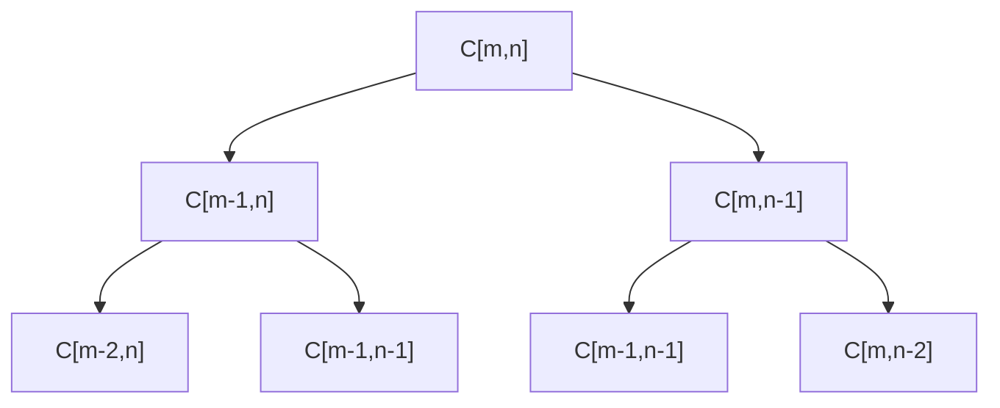

### LCS Problem
**Input:** A sequence $x = x_{1}x_{2}\dots x_{m}$, and a sequence $y=y_{1}y_{2}\dots y_{n}$
**Goal:** Output a longest common subsequence of $X$ and $Y$
- Focus on computing the length
- Parametrize the problem
$C[i,j]=$ length of LCS of $0 \leq i \leq m$, $x_{1}x_{2}\dots x_{i}$ and $0 \leq j \leq n$, $y_{1}y_{2}\dots y_{j}$
**Goal:** Compute $C[m,n]$
Claim: For $0 \leq i \leq m, 0 \leq j \leq n$
$$
c[i,j]=\begin{cases}
0 & if i = 0 or j = 0 \\
1 + c[i-1, j-1] & if x_{i}=y_{j} \\
MAX\{c[i-1, j], c[i, j-1]\} & else (i.e. x_{i} \neq y_{j})
\end{cases}
$$

**Proof:**
- Let $z_{1}z_{2}\dots z_{k}$ be a LCS of $x_{1}x_{2}\dots x_{i}$ and $y_{1}y_{2}\dots y_{j}$
- **Case 1:** Done
- **Case 2:** $x_{i}=y_{j}$, it must be the case that $z_{k}=x_{i}=y_{j}$
	- $\implies c[i,j]=1 + c[i-1,j-1]$
- **Case 3:** $x_{i} \neq y_{j}$, it must be the case that either $x_{i} \neq z_{k}$ or $y_{j} \neq z_{k}$ (or both)
	- so we check the subsequence before for both the first and second sequences, and we choose the one that produces the max value
	- $\implies c[i,j]=MAX\{C[i-1, j], C[i, j-1]\}$
	- This case is recursive, since

$=2^{min[m,n]}$ nodes

**\# of distinct subproblems**
- $=(m+1)(n+1)$
- $=O(mn)$

Maintain a table of computed solutions to avoid re-computing

#### Bottom-up Table Computation
```python
for i in range(0, m):
	T[i,0] = 0
for j in range(0, n):
	T[0,j] = 0
for i in range(1, m + 1):
	for j in range(1, n + 1):
		if x[i] == y[j]:
			T[i,j] = 1 + T[i - 1, j - 1]
		else:
			T[i,j] = Math.max[T[i - 1, j], T[i, j - 1]]
```

$O(mn)$ time
- Runtime of a dynamic program = (\# of subproblems) x (Time needed to compute a subproblem from previously computed entries)
- $= O(mn) \times O(1)$

### Elements of a Dynamic Programming Solution
**A. Optimal Substructure (Correctness)**
- Optimal solution to any problem is obtained by combining together optimal solutions to subproblems
**B. Overlapping Subproblems (Efficiency)**
- Different recursion branches generate same subproblems

### Knapsack Problem
**Input:** A set of $n$ items where each item $i$ has a positive integer weight $w_{i}$ and a positive integer profit $p_{i}$. You are also given a knapsack capacity $W$
**Goal:** Find a most profitable subset of items whose total weight $w \leq W$
Ex. Item 1: $p_{1}=2,w_{1}=1$
- Item 2: $p_{2}=W, w_{2}=W$
$T[i, w]=$ Most profit that can be collected by choosing a subset of first $i$ items when the knapsack capacity is set to $w$

**Goal:** Compute $T[n, W]$. 
**Base Case:** $T[0, w] = 0, 0 \leq w \leq W$
$T[i + 1, w] = MAX[T[i,w], p_{i+1} + T[i, w - w_{i+1}]]$ if $w \geq w_{i+1}$, else $(w < w_{i+1})$

**Runtime:** $O(nW) \times O(1) = O(nW)$ time
